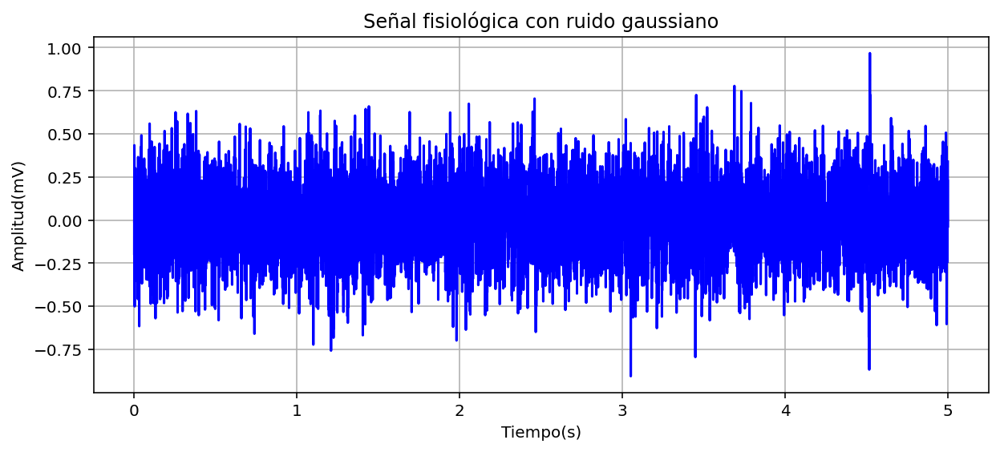

# ANÁLISIS DE DATOS ELECTROMIOGRÁFICOS EN UN ESTUDIO DE TAI CHI 

## DESARROLLO 

Para la implementación este laboratorio se hizo uso de un entorno de desarrollo integrado multiplataforma de código abierto llamado “Spyder” el cuál trabaja con el lenguaje de programación de Python y es el que nos permite realizar el cálculo y por consiguiente el análisis de los datos del estudio científico. 

Primeramente, se deben de descargar los archivos que contienen los datos del ya mencionado estudio los cuales están adjuntos en el presente repositorio y tienen como nombre “S0603_DT_V2.dat” y “S0603_DT_V2.hea”. Después de ello para que el código pueda acceder a esta información usamos las siguientes líneas de código que, además nos permite graficarlos para evidenciarlos de una manera visual y ver las contracciones en el músculo estudiado. 

  
      ECG = "S0603_DT_V2"
      
      # Leer la señal desde el archivo
      lecturasignal = wfdb.rdrecord(ECG)
      signal = lecturasignal.p_signal[:,0]  
      fs = lecturasignal.fs  
      numero_datos = len(signal) 
      muestreo=int(5*fs)
      
      # Grafica la señal muscular del gastrocnemio
      time = [i / fs for i in range(numero_datos)]  
      signal = signal[:muestreo]
      time = time[:muestreo]
      plt.figure(figsize=(12,4))
      plt.plot(time, signal, color="violet")
      
      plt.xlabel("Tiempo (s)")
      plt.ylabel("Amplitud (mv)")
      plt.title("Señal Biomédica EMG bases de datos physionet")
      plt.grid()
      plt.show()

Gráfica de la electromiografía en funcion de tiempo.

### HISTOGRAMA Y FUNCIÓN DE PROBABILIDAD

### MEDIA 

La media o también conocida como la media aritmética de los datos, es calculada como la suma de todos los valores obtenidos dividido por la cantidad de datos; en el contexto de este estudio, nos proporciona información de la actividad eléctrica promedio del gastrocnemio. Este valor nos podría indicar que tan intensamente está trabajando el músculo.  

Este valor fue calculado de manera tanto manual como por medio de funciones matemáticas y estadísticas ya integradas dentro de “Python”. Para el cálculo manual se hace una sumatoria de todos los datos por medio de un ciclo “for” y se divide por la cantidad de datos, el cual es calculado gracias a la función “len()”. Con respecto al cálculo directo con funciones de “Python” se utiliza una función integrada en las librerías de “numpy” la cual es “numpy.mean()”. Todos estos cálculos y resultados se muestran a continuación. 

      # Cálculo a mano de la media
      suma=0
      for i in range(len(signal)):
          suma += signal[i]
      media = suma/ len(signal)
      print(f"Media de la señal: {media:.4f}")
      
      # Cálculos con funciones de python
      media_librerias = np.mean(signal)
      
      # Resultados
      Media de la señal: -0.0005
      Media de la señal con librerias: -0.0005

### DESVIACIÓN ESTÁNDAR
La desviación estándar nos muestra que tanto se alejan los datos de las muestras con respecto a la media, en el contexto de la electromiografía nos puede decir la consistencia de la actividad muscular, que tanto cambio hay en la actividad muscular y si puede ser de manera impredecible por contracciones musculares irregulares. 

Para el cálculo manual se hace una sumatoria de la resta de cada uno de los datos con la media obtenida con anterioridad, se eleva al cuadrado, se divide por la cantidad de datos y por último se le saca la raíz. Para el cálculo directo de “Python” se implementa la función “numpy.std()” nuevamente perteneciente de la librería de “numpy”. A continuación, se presenta la respectiva programación y solución obtenida. 

      # Desviacion estandar
      desviacion = 0
      for i in range(len(signal)):
          desviacion += (signal[i] - media) ** 2
      desviacion_estandar = (desviacion/len(signal)) ** 0.5
      print(f"Desviación estándar: {desviacion_estandar:.4f}")
      
      # Desviación estándar con funciones de python
      desviacion_librerias = np.std(signal)
      print(f"Desviación estándar con librerias: {desviacion_librerias:.4f}")
      
      # Resultados
      Desviación estándar: 0.0752
      Desviación estándar con librerias: 0.0752

### COEFICIENTE DE VARIACIÓN
Por último, el coeficiente de variación se define como una medida de dispersión que hace una comparación de los valores obtenidos de la desviación estándar y la media por medio de un cociente y si se desea dar como un porcentaje se multiplica por 100. Hablando con el EMG, este es más usado para comparar valores y estudios de diferentes pacientes con diferentes valores de actividades musculares. 

El cálculo manual consiste en realizar el cociente entre la desviación estándar y la media, como se explicó anteriormente y con “Python” simplemente se realiza esa división entre los valores obtenidos en los ítems anteriores con ayuda de “numpy”. Los respectivos códigos, cálculos y resultados se muestran enseguida. 

      # Cálculo manual
      coeficiente_de_variacion = (desviacion_estandar/ media) if media != 0 else float ('nan')
      print(f"Coeficiente de variación: {coeficiente_de_variacion:.4f}")
      
      # Cálculo con funciones de Python
      coeficiente_variacion_librerias = (desviacion_librerias / media_librerias) if media_librerias != 0 else np.nan
      print(f"Coeficiente de variación con librerias: {coeficiente_variacion_librerias:.4f}")
      
      # Resultados obtenidos
      Coeficiente de variación: -151.2735
      Coeficiente de variación con librerias: -151.2735

## SNR

## INSTRUCCIONES 

1) Primeramente descargar o copiar y pegar el código de Python subido en este repositorio, el cuál esta guardado como "lab1V1.py", en el compilador que desee preferiblemente "Spyder". Cabe recalcar que debe asegurarse que se encuentren las librerias enlistadas en los requerimientos para que pueda compilarse adecuadamente el programa y muestre tanto las gráficas deseadas como los resultados de los cálculos.

2) Descargar los archivos que contienen los datos de la señal electromiográfica incluidos también en el presente repositorio con el nombre de “S0603_DT_V2.dat” y “S0603_DT_V2.hea”. Se aconseja que se guarden los archivos de este inciso y el anterior en la misma carpeta para su fácil acceso.

3) Correr el programa, esperar a que se compile por completo y si todo está en orden, se verán los resultados en el terminal de comandos de la manera que se muestra en la siguiente figura y sus respectivas gráficas.

## REQUERIMIENTOS
- Python 3.11
- Spyder 6.0
- Librerias como: wfdb, matplotlib, numpy, scipy.stats 
## REFERENCIAS

## AUTORES
- Juan Diego Clavijo Fuentes
  est.juan.dclavijjo@unimilitar.edu.co
- Sofia Olivella Moreo
  est.sofia.olivella@unimilitar.edu.co
