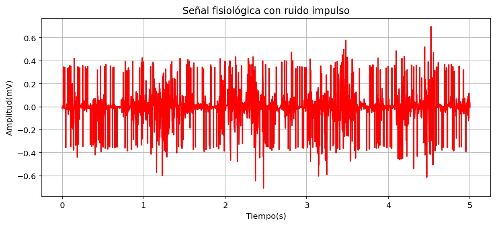

# lab-1-estadística

## DESARROLLO 

Para la implementación este laboratorio se hizo uso de un entorno de desarrollo integrado multiplataforma de código abierto llamado “Spyder” el cuál trabaja con el lenguaje de programación de Python y es el que nos permite realizar el cálculo y por consiguiente el análisis de los datos del estudio científico. 

Primeramente, se deben de descargar los archivos que contienen los datos del ya mencionado estudio los cuales están adjuntos en el presente repositorio y tienen como nombre “S0603_DT_V2.dat” y “S0603_DT_V2.hea”. Después de ello para que el código pueda acceder a esta información usamos las siguientes líneas de código que, además nos permite graficarlos para evidenciarlos de una manera visual y ver las contracciones en el músculo estudiado. 

  
      ECG = "S0603_DT_V2"
      
      # Leer la señal desde el archivo
      lecturasignal = wfdb.rdrecord(ECG)
      signal = lecturasignal.p_signal[:,0]  
      fs = lecturasignal.fs  
      numero_datos = len(signal) 
      muestreo=int(5*fs)
      
      # Grafica la señal muscular del gastrocnemio
      time = [i / fs for i in range(numero_datos)]  
      signal = signal[:muestreo]
      time = time[:muestreo]
      plt.figure(figsize=(12,4))
      plt.plot(time, signal, color="violet")
      
      plt.xlabel("Tiempo (s)")
      plt.ylabel("Amplitud (mv)")
      plt.title("Señal Biomédica EMG bases de datos physionet")
      plt.grid()
      plt.show()

Gráfica de la electromiografía en funcion de tiempo.

