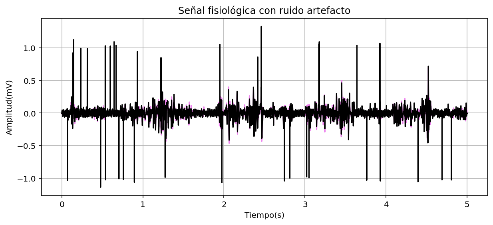

# ANÁLISIS DE DATOS ELECTROMIOGRÁFICOS EN UN ESTUDIO DE TAI CHI 

## DESARROLLO 

Para la implementación este laboratorio se hizo uso de un entorno de desarrollo integrado multiplataforma de código abierto llamado “Spyder” el cuál trabaja con el lenguaje de programación de Python y es el que nos permite realizar el cálculo y por consiguiente el análisis de los datos del estudio científico. 

Primeramente, se deben de descargar los archivos que contienen los datos del ya mencionado estudio los cuales están adjuntos en el presente repositorio y tienen como nombre “S0603_DT_V2.dat” y “S0603_DT_V2.hea”. Después de ello para que el código pueda acceder a esta información usamos las siguientes líneas de código que, además nos permite graficarlos para evidenciarlos de una manera visual y ver las contracciones en el músculo estudiado. 

  
      ECG = "S0603_DT_V2"
      
      # Leer la señal desde el archivo
      lecturasignal = wfdb.rdrecord(ECG)
      signal = lecturasignal.p_signal[:,0]  
      fs = lecturasignal.fs  
      numero_datos = len(signal) 
      muestreo=int(5*fs)
      
      # Grafica la señal muscular del gastrocnemio
      time = [i / fs for i in range(numero_datos)]  
      signal = signal[:muestreo]
      time = time[:muestreo]
      plt.figure(figsize=(12,4))
      plt.plot(time, signal, color="violet")
      
      plt.xlabel("Tiempo (s)")
      plt.ylabel("Amplitud (mv)")
      plt.title("Señal Biomédica EMG bases de datos physionet")
      plt.grid()
      plt.show()

Gráfica de la electromiografía en funcion de tiempo.

### HISTOGRAMA Y FUNCIÓN DE PROBABILIDAD

### MEDIA 

La media o también conocida como la media aritmética de los datos, es calculada como la suma de todos los valores obtenidos dividido por la cantidad de datos; en el contexto de este estudio, nos proporciona información de la actividad eléctrica promedio del gastrocnemio. Este valor nos podría indicar que tan intensamente está trabajando el músculo.  

Este valor fue calculado de manera tanto manual como por medio de funciones matemáticas y estadísticas ya integradas dentro de “Python”. Para el cálculo manual se hace una sumatoria de todos los datos por medio de un ciclo “for” y se divide por la cantidad de datos, el cual es calculado gracias a la función “len()”. Con respecto al cálculo directo con funciones de “Python” se utiliza una función integrada en las librerías de “numpy” la cual es “numpy.mean()”. Todos estos cálculos y resultados se muestran a continuación. 

      # Cálculo a mano de la media
      suma=0
      for i in range(len(signal)):
          suma += signal[i]
      media = suma/ len(signal)
      print(f"Media de la señal: {media:.4f}")
      
      # Cálculos con funciones de python
      media_librerias = np.mean(signal)
      
      # Resultados
      Media de la señal: -0.0005
      Media de la señal con librerias: -0.0005

### DESVIACIÓN ESTÁNDAR

### COEFICIENTE DE VARIACIÓN

## SNR

## INSTRUCCIONES 

## REQUERIMIENTOS

## REFERENCIAS

## AUTORES
- Juan Diego Clavijo Fuentes
  est.juan.dclavijjo@unimilitar.edu.co
- Sofia Olivella Moreo
  est.sofia.olivella@unimilitar.edu.co
